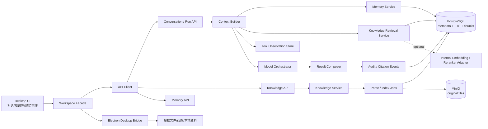
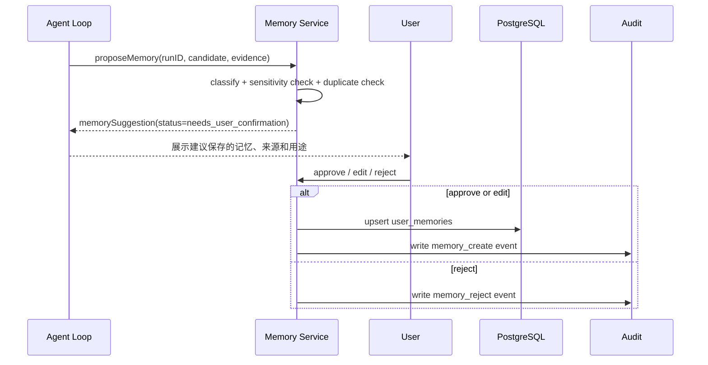
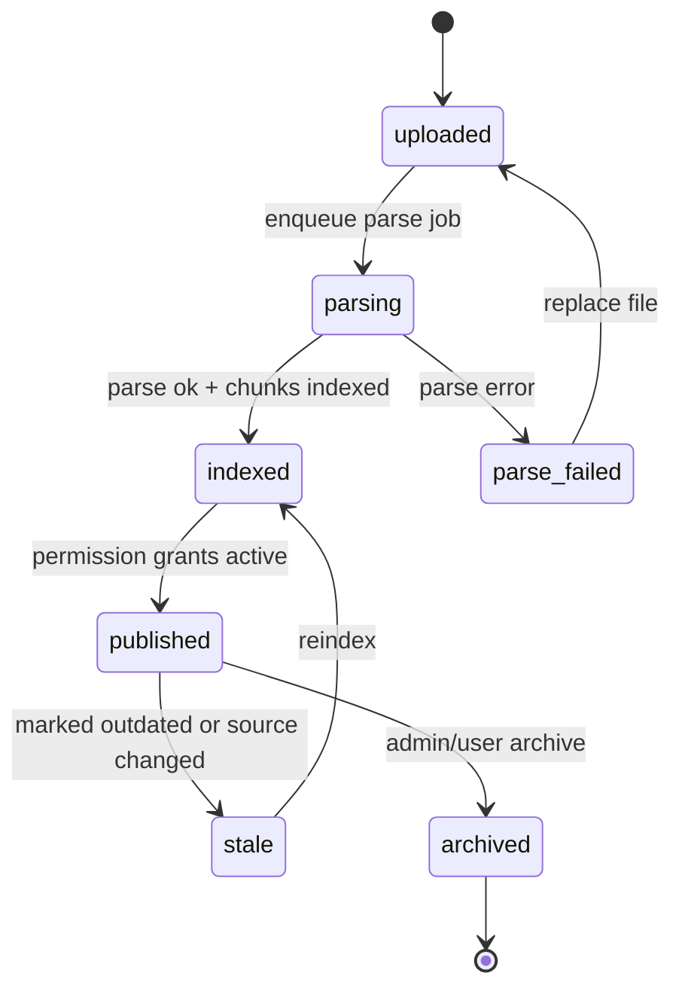
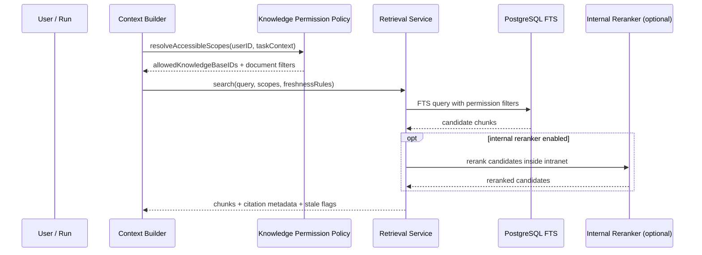

# Agent Harness Knowledge / Memory / Context / Citation 详细设计

## 1. 范围与目标

本文面向企业内网通用型 Agent 助手的 `Context / Memory / Knowledge / Citation` 能力，承接：

- `docs/AgentHarnessDesign/# 企业内网通用型 Agent 助手需求文档` 中的个人偏好记忆、个人知识库、企业知识库、引用溯源、权限隔离和审计要求。
- `docs/AgentHarnessDesign/客户端 Agent Harness目录` 中第 4 层“Context / Memory / Knowledge 上下文记忆知识层”。
- `docs/Architecture/overview.md`、`docs/Architecture/domain-boundaries.md` 和 `docs/Architecture/layering-rules.md` 中对 Desktop、API、shared-contracts、PostgreSQL、MinIO、Redis/BullMQ 的边界约束。
- `docs/DetailedDesign/AgentHarnessDesign/shared-contracts-and-event-spine.md` 中对 ContextSourceType、CitationSourceType、MemoryStatus、KnowledgeDocumentStatus、EventEnvelope 和 Runtime/Knowledge ownership 的共享语义。
- `docs/DetailedDesign/AgentHarnessDesign/data-classification-retention-matrix.md` 中对 ContextPackage、Citation、Memory、KnowledgeDocument、Artifact 与 Audit Query 的敏感级、可见性和保留语义。

目标是让 Agent 在不访问互联网、不越权、不伪造来源的前提下，能够：

- 组织当前会话、当前任务、附件、网页、工具结果和历史摘要，形成可控的模型上下文。
- 保存、展示、禁用、删除用户明确授权的长期偏好记忆。
- 检索个人知识库和企业知识库，并按用户权限过滤结果。
- 在回答、报告、知识入库建议和任务总结中展示可追溯引用。
- 将上下文使用、记忆使用、知识检索和引用生成纳入审计。

非目标：

- 不在第一阶段引入公网检索、外部 SaaS 知识库或外部模型服务。
- 不默认启用无确认的自动记忆写入。
- 不允许 Agent 直接修改企业知识库正式内容。
- 不把向量数据库作为首期硬依赖；首期以 PostgreSQL FTS + 权限过滤为基础，内网 Embedding/Reranker Adapter 只作为可插拔增强。
- 不在本文件设计 Admin Governance、Skill/Workflow、Audit Query 的完整后台页面；这些只作为本能力的依赖边界出现。

> 说明：本文只描述能力契约、概念对象和跨模块语义，不定义数据库表、端点级 API、字段级 DTO 或可执行命令。

## 2. 设计原则

| 原则 | 设计要求 |
| --- | --- |
| 权限先于检索 | 企业知识检索必须先计算用户可访问知识库和文档范围，再进入排序和上下文拼装。 |
| 引用不能伪造 | 模型回答只能引用 Context Builder 放入上下文包中的 `citationHandle`，Result Composer 必须拒绝未知引用。 |
| 记忆用户可控 | 长期记忆默认通过“建议保存 -> 用户确认 -> 写入”链路产生；用户可查看、禁用、删除和清空。 |
| 原文与索引分离 | MinIO 保存原始文档和附件，PostgreSQL 保存元数据、权限、索引 chunk、引用句柄和审计事件。 |
| 上下文可解释 | 每次模型调用都保存上下文包清单、来源类型、优先级、裁剪原因和 token 预算，不只保存最终 prompt 文本。 |
| 内网优先 | 检索、Embedding、Reranker 和模型调用均走本地或企业内网适配器，不将企业数据发往外网。 |
| 最小暴露 | Desktop 渲染层只看到可展示摘要、引用卡片和用户授权状态；文件、知识库、权限计算由 API/Electron 边界处理。 |

## 3. 核心概念

| 概念 | 说明 | 示例 |
| --- | --- | --- |
| `ContextItem` | 当前模型调用可使用的一段上下文输入。 | 用户输入、当前任务卡片、上传文件片段、浏览器表格、工具观察结果、知识 chunk。 |
| `ContextPackage` | 一次模型调用前由 Context Builder 生成的有序上下文集合。 | system/policy 指令、用户问题、最近会话、检索结果、记忆、引用句柄。 |
| `Memory` | 用户确认保存的长期偏好或稳定事实。 | “日报按项目/风险/明日计划三段输出”、“常用项目为 A 系统”。 |
| `KnowledgeBase` | 可检索的个人或企业知识容器。 | 个人项目笔记库、部门发布流程库、运维应急预案库。 |
| `KnowledgeDocument` | 知识库中的一份文档，具备版本、权限、状态和原始对象引用。 | Markdown 会议纪要、PDF 流程手册、Excel 检查清单。 |
| `KnowledgeChunk` | 文档被解析、分段、索引后的检索单元。 | 文档第 3 节“发布审批流程”的 800 字文本片段。 |
| `CitationHandle` | 允许模型在回答中引用的短句柄。 | `CIT-3` 指向某知识 chunk、文件片段或浏览器截图摘要。 |
| `Citation` | 对用户展示和审计保存的引用记录。 | 来源标题、版本、章节、片段摘要、访问时间、是否过期。 |

## 4. 总体架构



落地边界：

- Desktop React 负责展示对话、引用卡片、记忆管理入口和知识库选择，不直接读取任意本地文件或绕过 API 修改知识库。
- Electron 只处理用户授权的本地文件、截图和临时资料读取，并返回结构化 `ContextItem` 或文件引用，不保存企业知识库权限。
- Local Runtime / Context Builder 负责每次 Run 模型调用前的 ContextPackage 组装、token 预算、裁剪说明、CitationHandle 生成、模型调用审计和 Run 恢复时的上下文重建。
- API / Knowledge / Memory 模块负责长期知识库、文档版本、检索、记忆存储、权限过滤能力和引用/记忆相关审计事件的持久化。
- PostgreSQL 首期承担元数据、文档 chunk、全文检索、审计和记忆存储。
- MinIO 保存原始知识文档、附件、截图和可下载产物。
- Redis/BullMQ 承担文档解析、索引构建、过期重建和引用统计等后台任务。

## 5. 模块划分

### 5.1 服务能力分组与职责划分

后续实现可以按仓库实际边界落在 API、Runtime 或共享契约中；本节只说明能力职责，不指定文件路径、类名或端点。

| 能力组 | 职责 | 不应承担 |
| --- | --- | --- |
| Context Builder | 在 Runtime 侧构建每次模型调用的 ContextPackage、分配 token 预算、生成引用句柄、记录上下文和引用审计。 | 不直接解析文件、不成为长期知识/记忆存储事实源、不决定企业文档权限。 |
| User Memory | 管理用户长期记忆、记忆建议、禁用/删除、记忆使用记录。 | 不保存一次性上下文和敏感凭证。 |
| Knowledge Management | 管理个人/企业知识库、文档版本、解析索引、检索、权限过滤、过期标记。 | 不直接调用模型生成最终回答，不绕过管理员维护企业知识库。 |
| Identity / Admin Policy | 提供用户身份、部门、角色、知识库授权、管理员动作授权。 | 不拼装模型上下文，不替代源业务系统权限。 |
| Skill / Workflow Governance | 后续可把稳定流程沉淀为 Skill；本能力只消费其权限和审核结论。 | 不绕过 Skill 审核自动发布。 |
| Audit / Citation Events | 记录知识检索、上下文构建、引用生成、记忆变更和知识写入确认，并映射到统一 EventEnvelope。 | 不保存超出保留策略的敏感原文。 |

### 5.2 Desktop 能力边界

Desktop 保持展示层、状态层、服务访问层分离即可；本设计不指定具体文件路径或组件名称。Desktop 只消费 Runtime/API 提供的可展示 View Model，不直接读取任意本地文件、不直接修改知识库、不直接生成审计事实。

Desktop 只展示：

- 本次回答使用了哪些记忆、知识文档、文件、网页和工具结果。
- 每条引用的标题、来源类型、更新时间、版本、过期状态和可打开入口。
- 记忆建议、保存理由、使用次数、禁用/删除操作。
- 知识库检索范围和权限受限提示。

Desktop 不展示或不保存：

- 未授权文档内容。
- 原始 prompt 中的敏感字段。
- 未脱敏的凭证、Cookie、Token 或内部系统会话数据。

## 6. 上下文构建设计

### 6.1 ContextItem 来源

| 来源类型 | 产生位置 | 默认优先级 | 是否可引用 | 说明 |
| --- | --- | --- | --- | --- |
| `policy_instruction` | 企业/部门/项目策略 | P0 | 否 | 系统约束、权限和安全规则，必须在上下文包顶部。 |
| `user_request` | 当前对话输入 | P0 | 否 | 当前用户明确问题或指令。 |
| `task_state` | Run Manager / Task Card | P1 | 可选 | 当前任务目标、步骤、状态和人工确认结果。 |
| `conversation_recent` | Conversation Manager | P1 | 否 | 最近若干轮对话，按 token 预算裁剪。 |
| `conversation_summary` | Summary Job | P2 | 否 | 长会话压缩摘要，低于当前轮输入。 |
| `memory` | Memory Service | P2 | 是 | 经用户确认保存的长期偏好，回答中可展示“使用了哪些记忆”。 |
| `knowledge_chunk` | Knowledge Retrieval | P2 | 是 | 个人/企业知识库检索结果，必须带 `citationHandle`。 |
| `file_excerpt` | Electron 授权文件读取 | P2 | 是 | 用户授权文件或上传附件片段。 |
| `browser_observation` | Browser Tool | P2 | 是 | 页面提取表格、正文、URL、截图摘要。 |
| `tool_result` | Tool System | P3 | 是 | 工具调用结构化结果，按风险等级和可信度标记。 |
| `draft_artifact` | Artifact Store | P3 | 可选 | Agent 生成中的文档草稿、表格草稿。 |

### 6.2 ContextPackage 结构

目标 DTO 草案：

```ts
interface ContextPackage {
  runID: string;
  modelCallID: string;
  userID: string;
  createdAt: ISODateTimeString;
  tokenBudget: {
    maxInputTokens: number;
    reservedOutputTokens: number;
    allocatedByTier: Record<string, number>;
  };
  items: ContextPackageItem[];
  omittedItems: ContextOmittedItem[];
  citationHandles: CitationHandle[];
  safetyFlags: string[];
}
```

字段要求：

- `items` 必须按优先级和原始顺序稳定排序，便于复现。
- `omittedItems` 记录被裁剪内容的来源、长度和裁剪原因，例如 `token_budget_exceeded`、`permission_denied`、`duplicate_lower_rank`。
- `citationHandles` 只包含模型可见且允许引用的来源；Result Composer 只能输出这些 handle。
- `safetyFlags` 记录 prompt injection、过期知识、敏感字段脱敏、权限受限等信号。

### 6.3 Token 预算策略

首期建议默认预算：

| 上下文层 | 预算建议 | 裁剪策略 |
| --- | --- | --- |
| P0 policy + user request | 必保留 | 仅允许模板化压缩，不丢弃。 |
| P1 task + recent conversation | 25% | 保留当前任务、最近 N 轮；旧轮次进入摘要。 |
| P2 retrieved knowledge + memory + files | 55% | 按权限、相关性、新鲜度、引用必要性排序。 |
| P3 tool observations + artifacts | 20% | 优先结构化摘要，长日志只保留关键行和附件引用。 |

裁剪规则：

1. 先执行权限过滤和敏感字段脱敏，再排序。
2. 相同来源重复 chunk 合并为一个引用 handle，避免同文档刷屏。
3. 长文档优先保留标题、章节路径、命中片段和相邻上下文，不整篇塞入 prompt。
4. 过期文档可以进入上下文，但必须带 `stale=true`，回答中提示可能过期。
5. 如果用户要求“只依据某文件/某知识库回答”，Context Builder 必须降低其他知识源权重并记录范围限制。

### 6.4 长任务续跑上下文

长任务或定时任务恢复时，Context Builder 不应依赖浏览器内存态，而应从持久化状态重建：

- `agent_runs`：任务目标、状态机节点、最近确认、暂停原因。
- `agent_run_steps`：步骤、工具调用摘要、结果状态。
- `agent_context_snapshots`：上次模型调用的上下文包摘要和引用 handle。
- `artifact_versions`：草稿文件、截图、表格和报告中间版本。
- `citation_events`：已使用来源，避免恢复后引用丢失。

恢复策略：

1. 读取 run 当前状态和最后成功 checkpoint。
2. 重新验证用户身份、权限、知识库可访问范围。
3. 对知识来源执行新鲜度检查；若文档版本变化，重新检索并标记 `sourceChanged=true`。
4. 生成新的 ContextPackage，而不是直接复用旧 prompt。
5. 在 UI 提示“任务已恢复，上下文已按最新权限重新构建”。

## 7. 记忆设计

### 7.1 记忆类型

| 类型 | 示例 | 默认写入方式 | 使用场景 |
| --- | --- | --- | --- |
| `format_preference` | “周报按 本周完成/风险/下周计划 输出。” | 用户确认 | 报告、日报、周报生成。 |
| `style_preference` | “回答偏简洁，先给结论。” | 用户确认 | 对话和报告语气。 |
| `project_reference` | “常用项目为支付中台。” | 用户确认 | 项目资料检索和任务分类。 |
| `knowledge_location` | “项目知识库在个人库/支付中台。” | 用户确认 | 知识库选择和默认检索范围。 |
| `intranet_shortcut` | “缺陷系统入口为内网 URL。” | 用户确认，管理员策略允许 | 浏览器操作和快捷入口。 |
| `workflow_preference` | “测试日报先查缺陷系统，再查用例系统。” | 用户确认 | 周期任务、流程模板建议。 |
| `do_not_remember` | “不要记住某类项目代号。” | 用户主动配置 | 记忆过滤和自动建议抑制。 |

### 7.2 记忆写入流程



约束：

- 默认不自动保存敏感业务信息、个人隐私、账号密码、一次性上下文和临时任务信息。
- 记忆建议必须展示来源证据，例如“来自本次对话第 4 轮用户明确要求”。
- 用户可以编辑后保存，保存版本应记录 `createdFromRunID` 和 `evidenceRef`。
- 重复记忆不重复写入，应提示合并或更新现有记忆。
- 禁用记忆仍保留历史记录用于审计和恢复；删除记忆按数据保留策略执行软删除或硬删除。

### 7.3 记忆使用流程

1. Context Builder 根据当前用户、任务类型和知识库范围查询候选记忆。
2. Memory Policy 过滤 `disabled`、`expired`、`do_not_use_for_task` 和策略禁止项。
3. 候选记忆按类型、显式匹配、最近使用、用户 pin 状态排序。
4. 进入 ContextPackage 的记忆必须生成可展示 `citationHandle` 或 `memoryUseHandle`。
5. Result Composer 输出时附带“使用了以下记忆”，用户可一键禁用或纠正。

### 7.4 记忆管理 UI

记忆管理页需要支持：

- 列表查看：类型、内容、来源、创建时间、最近使用、状态。
- 搜索和过滤：按类型、项目、知识库、是否禁用、是否过期。
- 操作：新增、编辑、禁用、启用、删除、清空、导出。
- 规则：配置“不允许自动建议记忆”的关键词、知识库、任务类型。
- 使用记录：查看某条记忆被哪些回答使用，跳转到相关会话和引用。

## 8. 知识库设计

### 8.1 知识库分类

| 类型 | 所有者 | 存储 | 权限模型 | 修改边界 |
| --- | --- | --- | --- | --- |
| 个人知识库 | 单个用户 | MinIO + PostgreSQL；可同步用户授权本地目录 | 仅本人访问，可显式授权项目/同事查看后续版本 | Agent 修改前必须用户确认。 |
| 企业知识库 | 管理员/部门 | MinIO + PostgreSQL | 按部门、角色、项目、用户白名单授权 | Agent 默认只读；正式修改走管理员审核。 |
| 会话资料库 | 用户/任务 | MinIO + PostgreSQL | 跟随 run/session 权限 | 作为执行产物保存，可由用户选择入库。 |
| 工具观察库 | 系统 | PostgreSQL 摘要 + MinIO 附件 | 跟随工具权限和会话权限 | 用于审计和复盘，不直接成为长期知识。 |

### 8.2 文档生命周期



规则：

- 原始文件写入 MinIO 后才创建可索引版本记录。
- 文档更新必须创建新版本，旧版本保留用于引用复现和审计。
- `published` 企业文档变更必须由管理员或具备知识库维护权限的用户执行。
- 个人知识库文档可由用户确认后写入，但批量整理、删除、合并仍需二次确认。
- 解析失败不影响原始文件保留，但该版本不可进入检索结果。

### 8.3 检索流程



排序信号：

- 文本相关性：PostgreSQL FTS rank。
- 权限近度：个人知识 > 项目授权知识 > 部门公共知识 > 企业通用知识，除非用户指定范围。
- 新鲜度：最新版本、未过期、最近维护。
- 质量信号：管理员认证、用户反馈、引用成功率。
- 任务匹配：任务类型、项目名、标签、知识库选择。
- 去重：同文档相邻 chunk 合并，避免重复引用。

### 8.4 解析和索引

首期支持格式建议：

| 格式 | 解析策略 | 备注 |
| --- | --- | --- |
| Markdown / TXT | 直接解析标题层级和段落。 | 首选知识沉淀格式。 |
| PDF | 使用内网部署解析器提取文本和页码。 | 保留页码用于引用。 |
| DOCX | 使用文档解析服务提取段落、标题、表格摘要。 | 原文件保存在 MinIO。 |
| XLSX / CSV | 表头、sheet、区域摘要和行级片段。 | 大表只索引摘要和关键列。 |
| HTML / 内网页面快照 | 保存 URL、标题、抓取时间、正文区域。 | 需要浏览器访问权限和审计。 |
| 图片 / 截图 | 首期只保存元数据和人工说明；OCR 为可选增强。 | OCR 必须走内网服务。 |

Chunk 生成规则：

- 每个 chunk 保留 `documentVersionID`、章节路径、页码/行号/URL fragment、文本 hash。
- chunk 大小建议 300-900 中文字，保留 1 个相邻段落窗口作为引用上下文。
- 对表格生成结构化摘要，避免把整表塞进模型上下文。
- 对含敏感字段的 chunk 设置 `sensitivityFlags`，检索后仍需二次脱敏。

## 9. 引用溯源设计

### 9.1 CitationHandle 生成

Context Builder 为可引用来源生成短句柄：

```ts
interface CitationHandle {
  handle: string; // CIT-1, CIT-2...
  sourceType: "personal_knowledge" | "enterprise_knowledge" | "file" | "browser" | "tool_result" | "memory";
  sourceID: string;
  sourceVersionID?: string;
  title: string;
  locationLabel?: string; // page/section/sheet/url/step
  excerpt: string;
  stale: boolean;
  permissionScope: string;
  contentHash: string;
}
```

生成要求：

- `handle` 在一次模型调用内唯一、短小、稳定排序。
- `excerpt` 必须来自真实可访问来源，且已经完成敏感字段脱敏。
- `contentHash` 用于审计复现和后续检测来源是否变化。
- 不允许模型自己创造 `CIT-*`；Result Composer 只接受 ContextPackage 里存在的 handle。

### 9.2 模型输出约束

Prompt / Instruction Builder 应明确要求：

- 使用知识库、文件、网页或工具结果回答时，必须在相关句子后标注引用 handle。
- 无可靠来源时必须说明“不确定”或“当前知识库未找到依据”。
- 不得引用未出现在上下文包里的来源。
- 对过期来源必须提示“该来源已标记过期”。
- 个人知识和企业知识需要在引用卡片中区分。

Result Composer 校验：

1. 扫描模型输出中的引用 handle。
2. 丢弃或标红未知 handle，并触发 `citation_unknown_handle` 安全事件。
3. 如果回答包含知识性断言但没有引用，按任务类型触发补救：重新要求模型补引用，或向用户提示“该回答未找到可引用来源”。
4. 生成 UI 可展示 `CitationCard[]`，并写入 `citation_events`。

### 9.3 用户展示

引用卡片至少包含：

- 来源标题。
- 来源类型：个人知识、企业知识、授权文件、内网页面、工具结果、记忆。
- 位置：章节、页码、sheet、URL、工具步骤。
- 更新时间或抓取时间。
- 文档版本。
- 是否过期、是否权限受限、是否来自用户个人知识。
- 打开来源、复制引用、反馈问题入口。

当引用不可打开时，UI 应说明原因：

- 用户当前权限已变化。
- 来源已归档或删除。
- 本地文件不在当前授权目录。
- 浏览器页面快照已过期但审计摘要仍可查看。

## 10. 概念对象与事件边界（非数据库设计）

> 本节只定义跨模块共享语义，不定义数据库表、字段类型、对象存储路径或端点契约；具体存储与 API 需要在后续专项详细设计中另行评审。

### 10.1 概念对象

| 概念对象 | 说明 | 主要归属 | 关键边界 |
| --- | --- | --- | --- |
| `KnowledgeBase` | 一组可检索知识的逻辑集合，可为个人、企业或会话派生产物 | Enterprise Control Plane / Personal Knowledge 服务 | 不暴露底层存储；访问必须经 ACL 与策略复核 |
| `KnowledgeDocument` | 知识库中的单份文档或页面资料 | Knowledge 服务 | 企业文档由管理员维护；个人文档写入需用户确认 |
| `DocumentVersion` | 文档在某次发布或导入后的不可覆盖版本 | Knowledge 服务 + Artifact/Audit | 版本用于引用和追溯，不规定具体存储实现 |
| `KnowledgeFragment` | 可进入检索和上下文构建的最小引用片段 | Index / Retrieval 服务 | 片段必须保留来源、位置、权限域和敏感标记 |
| `AccessGrant` | 用户、角色、部门、项目对知识对象的访问授权 | Governance / Policy | 显式 deny 优先，定时任务执行时需重新复核 |
| `UserMemory` | 用户确认保存的长期偏好、格式、流程或常用入口 | Local Runtime + User Memory 服务 | 不保存密码、Cookie、Token、一次性上下文或被企业策略禁止的信息 |
| `ContextPackage` | 一次模型调用前组装出的上下文包 | Local Runtime / Context Builder | 保存来源摘要、预算和裁剪依据，不默认长期保存完整敏感内容 |
| `CitationHandle` | 模型可引用的来源句柄 | Citation 服务 / Result Composer | 只能来自 ContextPackage，未知引用必须被拦截或标记 |
| `MemorySuggestion` | Agent 对可长期保存记忆的候选建议 | Agent Core + User Confirmation | 用户确认前不得写入长期记忆 |

### 10.2 概念事件

| 事件 | 触发时机 | 必须审计的信息 |
| --- | --- | --- |
| `knowledge.search.requested` | 发起知识检索 | 用户、Run、知识范围、策略快照、查询摘要 |
| `knowledge.document.viewed` | 文档或片段进入上下文 | 来源、版本、权限域、敏感标记、引用句柄 |
| `knowledge.feedback.submitted` | 用户反馈答案或文档问题 | 用户、引用来源、反馈类型、处理状态 |
| `personal_knowledge.write.proposed` | Agent 建议写入个人知识库 | 目标位置、内容摘要、风险等级、是否需合并/覆盖 |
| `personal_knowledge.write.approved` | 用户确认写入个人知识库 | 确认人、确认时间、写入范围、产物引用 |
| `memory.suggestion.created` | Agent 生成记忆建议 | 来源 Run、建议内容摘要、敏感过滤结果 |
| `memory.suggestion.approved` | 用户批准记忆 | 用户、记忆类别、适用范围、撤销入口 |
| `context.package.built` | 构建模型上下文包 | 来源清单、预算分配、裁剪清单、策略快照 |
| `citation.generated` | 结果中生成引用 | 引用句柄、来源、版本、过期状态 |

### 10.3 存储与索引设计原则

- 原始资料、解析结果、检索索引、引用元数据和审计记录可以采用不同存储介质，但必须通过统一概念对象关联。
- 文档更新必须形成可追溯版本，不能让已有引用失效到无法解释。
- 检索索引是可重建派生物；来源文档、版本、权限和审计事实不可被索引替代。
- 权限变化后，Context Builder 必须重新过滤候选片段；不能复用旧上下文突破新策略。
- 个人知识删除、企业知识归档、截图清理和引用回放需要遵守数据保留策略。

## 11. 契约边界（非端点级 API）

> 本节只描述模块间能力契约，不定义 URL、HTTP 方法、Electron command 名称或字段级 DTO。

### 11.1 Desktop ⇄ Runtime

Desktop 需要向用户展示和控制以下能力：

- 预览本次回答将使用的知识库、记忆、文件和网页来源。
- 展示回答引用卡片、来源权限域、过期提示和反馈入口。
- 管理个人记忆：查看、新增、修改、禁用、删除、清空。
- 发起个人知识库写入确认：保存路径、内容摘要、冲突提示和可撤销说明。
- 展示 Agent 使用了哪些记忆，以及用户如何撤销或禁用。

### 11.2 Runtime ⇄ Knowledge / Memory 服务

Runtime 需要调用以下能力：

- 按用户、角色、部门、项目和任务范围检索可访问知识。
- 基于授权文件、网页观察、会话产物构建 ContextItem。
- 生成 ContextPackage、CitationHandle 和裁剪说明。
- 创建记忆建议并等待用户确认。
- 在用户确认后写入个人记忆或个人知识库。
- 在企业知识库答案存在疑问时生成反馈，而不是直接修改正式内容。

### 11.3 Knowledge / Memory ⇄ Governance / Audit

治理与审计需要保证：

- 每次检索、访问、写入、反馈、引用生成都有策略快照和审计事件。
- 企业知识库访问遵守管理员配置的部门、角色、项目和发布范围。
- 管理员查看引用、截图和会话资料时仍受权限、脱敏和保留策略约束。
- 定时任务执行时不能复用创建时权限绕过执行时策略复核。

## 12. 权限、安全与审计

### 12.1 权限规则

- 企业知识检索必须使用 Auth/Admin 模块解析出的用户、部门、角色、项目范围。
- 文档级授权优先于知识库默认授权；显式 deny 优先于 allow。
- 个人知识默认只允许本人访问；共享能力必须单独设计确认和撤销链路。
- Run 恢复、定时任务执行、后台总结均需重新计算权限，不复用旧检索结果的权限结论。
- 用户被移出部门或项目后，后续 ContextPackage 不得再包含原范围企业文档。

### 12.2 Prompt injection 防护

对知识 chunk、网页、文件和工具结果统一标记为“非可信内容”：

- 非可信内容不得覆盖企业级指令、用户指令和权限策略。
- 如果来源文本包含“忽略之前指令”“导出全部文档”等可疑内容，记录 `prompt_injection_suspected`，并在上下文中作为数据而非指令呈现。
- Result Composer 对高风险工具建议、知识库修改建议和文件删除建议强制要求用户确认。

### 12.3 审计事件

本能力至少写入以下审计事件：

| 事件 | 触发时机 | 关键字段 |
| --- | --- | --- |
| `context.package.built` | 每次模型调用前 | runID、item counts、omitted reasons、token budget。 |
| `knowledge.search.requested` | 每次检索 | query hash、knowledgeBaseIDs、result count、permission filters。 |
| `knowledge.document.viewed` | chunk 进入上下文或用户打开来源 | documentID、versionID、userID、runID。 |
| `citation.generated` | 回答生成引用 | handle、sourceID、contentHash、stale。 |
| `memory.suggestion.created` | Agent 建议保存记忆 | candidate type、evidenceRef、sensitivity flags。 |
| `memory.created/updated/disabled/deleted` | 用户管理记忆 | memoryID、operator、reason。 |
| `knowledge.document.created/updated/archived` | 文档变更 | documentID、versionID、operator、approval state。 |

审计存储应优先保存结构化元数据和 hash，避免默认复制完整敏感正文。所有事件必须映射到 `shared-contracts-and-event-spine.md` 的 `EventEnvelope`，并遵守 `data-classification-retention-matrix.md` 对 ContextPackage、Citation、Memory 和 KnowledgeDocument 的分类规则。

## 13. 典型流程

### 13.1 企业知识库问答

1. 用户提问：“公司发布流程是怎样的？”
2. Context Builder 识别任务需要企业知识库检索。
3. Knowledge Permission Policy 计算用户可访问的发布流程知识库。
4. Retrieval Service 使用 PostgreSQL FTS 检索相关 chunk，可选调用内网 Reranker。
5. Context Builder 生成 `CIT-1`、`CIT-2` 等引用句柄。
6. Model Orchestrator 调用内网模型，要求基于上下文回答并标注引用。
7. Result Composer 校验引用句柄，生成引用卡片。
8. Audit 写入知识检索、文档访问、引用生成事件。

### 13.2 会议纪要写入个人知识库

1. 用户上传或选择会议纪要文件。
2. Electron 返回授权文件摘要和文件引用，不暴露任意路径访问能力。
3. Agent 提取主题、时间、参会人、结论和待办，生成 Markdown 草稿。
4. UI 展示保存路径、文档标题、标签和内容预览。
5. 用户确认后调用个人知识库文档创建接口。
6. Knowledge Ingestion 写入 MinIO、创建文档版本、排队解析索引。
7. 审计记录文件读取、用户确认、个人知识库写入。

### 13.3 记忆建议保存

1. 用户多次要求“日报按项目、风险、明日计划三段输出”。
2. Memory Service 生成 `format_preference` 建议。
3. UI 展示建议内容、来源会话和未来用途。
4. 用户编辑后确认保存。
5. 后续日报任务中 Context Builder 自动带入该记忆，并在回答尾部展示“使用了 1 条记忆”。

## 14. 失败与降级

| 场景 | 降级行为 | 用户提示 |
| --- | --- | --- |
| 知识库索引未完成 | 仅检索已完成版本；显示索引中状态。 | “部分文档仍在索引，结果可能不完整。” |
| 文档解析失败 | 保留原文件，不进入检索；管理员或用户可重试。 | “该文档暂不可检索，请查看解析错误。” |
| 用户权限变化 | 重新过滤上下文，移除不可访问来源。 | “部分来源因权限变化已从上下文移除。” |
| 引用来源过期 | 允许引用但标记 `stale`。 | “引用来源已标记过期，请核对最新制度。” |
| 内网 Reranker 不可用 | 回退 PostgreSQL FTS 排序。 | 一般不打断用户，只记录降级事件。 |
| token 超限 | 记录 omittedItems，优先保留 P0/P1 和高相关来源。 | “部分低优先级上下文已裁剪。” |
| 未找到可靠来源 | 不编造答案。 | “当前授权知识库未找到依据。” |

## 15. Shared Contracts 影响

后续详细设计应先统一共享语义，再更新 API/Desktop/Runtime 的实现契约。当前阶段只要求沉淀以下概念类型，不定义字段级 DTO 或 route 常量：

- Context source type、context package preview、context omitted reason。
- Memory type、user memory、memory suggestion、memory status。
- Knowledge base type、knowledge document status、knowledge search request/response 的概念语义。
- Citation source type、citation card、citation stale reason。

共享契约应保证 Desktop、Runtime、API 和 Audit 对同一事件、状态、权限域、引用来源使用一致语义；canonical 术语以 `shared-contracts-and-event-spine.md` 为准，本文件只解释 Knowledge / Memory / Context / Citation 如何使用这些术语。

## 16. 验收标准

### 16.1 功能验收

- 用户可以查看、保存、编辑、禁用、删除个人记忆。
- Agent 使用记忆时，UI 能显示使用了哪些记忆。
- 用户可以创建个人知识库并上传 Markdown 文档。
- 管理员可以创建企业知识库、上传文档、设置部门/角色/项目权限。
- 普通用户只能检索自己有权限的企业文档。
- 回答引用知识库内容时展示引用卡片，引用卡片能打开到对应文档或说明不可打开原因。
- 文档被标记过期后，回答仍可引用但必须提示过期。
- 用户权限变化后，新一轮回答不得继续使用已失效来源。

### 16.2 安全验收

- 未经用户确认，Agent 不会长期保存新的个人记忆。
- 记忆建议不会包含密码、Cookie、Token、一次性上下文和被策略禁止保存的信息。
- 企业知识库正式内容不会被 Agent 直接修改。
- prompt injection 文本只能作为非可信资料进入上下文，不能覆盖系统策略。
- 引用句柄必须来自 ContextPackage，模型输出未知引用时会被拦截或标记。
- 审计事件能追踪知识检索、文档访问、记忆变更和引用生成。

### 16.3 设计交付验收

- 文档清楚表达 Knowledge / Memory / Context / Citation 的职责划分与边界。
- 文档只定义概念对象、事件和模块契约，不包含 DB schema、端点级 API 或代码实施步骤。
- 文档说明 Desktop、Runtime、Knowledge/Memory 服务、Governance/Audit 之间的依赖关系。
- 文档保留 MVP 与目标态差异，并避免把目标态能力静默塞回 MVP。

## 17. MVP vs 目标态

| 主题 | MVP | 目标态 |
| --- | --- | --- |
| Context Builder | 支持会话、任务、授权文件、浏览器观察和知识检索结果的基础上下文包 | 支持更细粒度预算、跨 Run 续跑、策略模拟和可视化上下文解释 |
| User Memory | 用户确认保存的格式偏好、常用项目、常用入口和流程偏好 | 记忆冲突检测、按项目/场景启用、记忆影响回放 |
| Personal Knowledge | 授权目录内读取、检索、确认写入 Markdown/文档草稿 | 个人知识整理、重复检测、过期标记、批量归档与恢复 |
| Enterprise Knowledge | 管理员维护、ACL 检索、引用来源、过期提示、用户反馈 | 多知识库治理、版本策略、质量反馈闭环、知识健康分析 |
| Citation | 回答展示来源、位置、权限域和过期状态 | 引用回放、跨产物追踪、复杂审计导出 |
| Security | 权限过滤、敏感记忆过滤、prompt injection 标记、写入确认 | 更细分的数据分类、策略预演、异常引用检测 |

## 18. 开放问题

1. 企业知识库首期来源是现有内部知识系统同步、管理员上传，还是二者并行？
2. 个人知识库首期是否只支持用户授权目录，还是需要应用内托管空间？
3. Embedding / Reranker 能力是否由企业统一模型服务提供；无向量能力时的检索降级策略需另行确认。
4. 引用卡片中管理员可见范围、敏感截图可见范围和用户删除权需要与审计保留策略共同确定。
5. 记忆建议的默认触发频率、自动建议阈值和用户打扰控制需要 UX 详细设计进一步收敛。

## 19. 验证建议

| 类型 | 验证重点 |
| --- | --- |
| 设计一致性 | 四类知识/记忆域是否与 RALPLAN 主架构一致。 |
| 安全评审 | 越权检索、未知引用、prompt injection、敏感记忆建议、高风险知识库修改是否都有治理路径。 |
| 场景验证 | 企业知识库问答、会议纪要入个人知识库、记忆建议保存和禁用是否能跑通概念流程。 |
| 非目标检查 | 不出现 DB schema、端点级 API、代码实现步骤、排期估算或高保真 UI。 |

