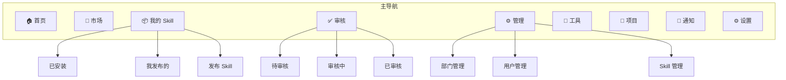
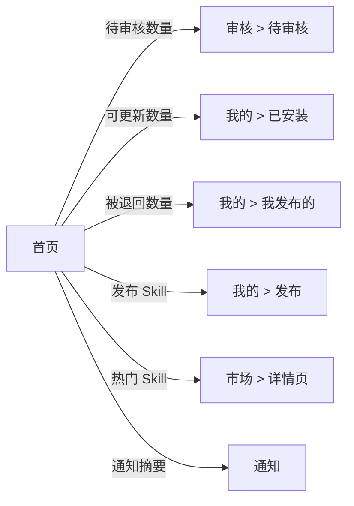
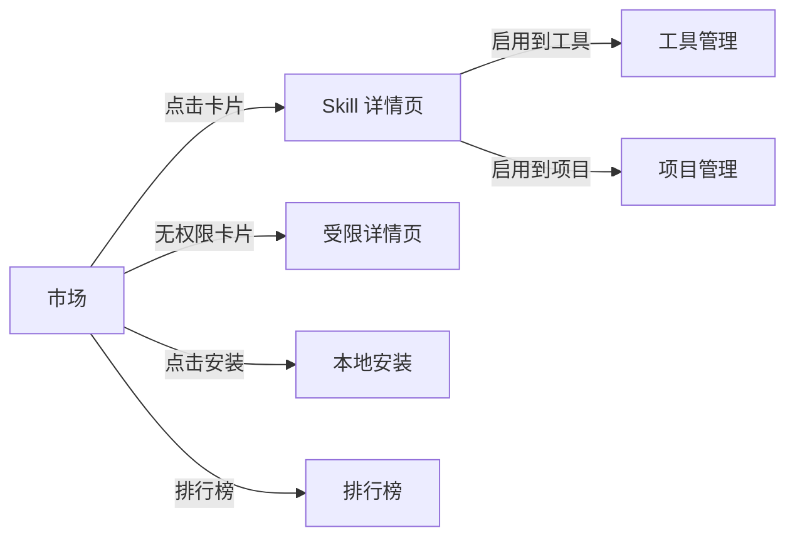

# 7. 页面架构与导航

## 7.1 一级页面

系统本期包含以下一级页面：

| # | 页面 | 角色可见性 | 说明 |
|---|------|-----------|------|
| 1 | 🏠 首页 | 全部 | 系统入口，待办、动态、推荐 |
| 2 | 🛒 市场 | 全部 | Skill 发现与安装 |
| 3 | 📦 我的 Skill | 全部 | 已安装、我发布的、发布 |
| 4 | ✅ 审核 | 管理员 | 审核工作台 |
| 5 | ⚙️ 管理 | 管理员 | 部门/用户/Skill 管理 |
| 6 | 🔧 工具 | 全部 | 本机 AI 工具管理 |
| 7 | 📁 项目 | 全部 | 项目维度 Skill 管理 |
| 8 | 🔔 通知 | 全部 | 系统消息 |
| 9 | ⚙️ 设置 | 全部 | 偏好设置 |
| 10 | 🔌 MCP | 预留 | 本期不展示 |
| 11 | 🧩 插件 | 预留 | 本期不展示 |

---

## 7.2 全局布局

```
┌─────────────────────────────────────────────────────┐
│  Logo / 应用名称         搜索栏        通知  用户头像  │
├──────────┬──────────────────────────────────────────┤
│          │                                          │
│  侧栏    │              主内容区                     │
│  导航    │                                          │
│          │                                          │
│  🏠 首页  │                                          │
│  🛒 市场  │                                          │
│  📦 我的   │                                          │
│  ✅ 审核   │                                          │
│  ⚙️ 管理  │                                          │
│  🔧 工具  │                                          │
│  📁 项目  │                                          │
│  🔔 通知  │                                          │
│  ──────  │                                          │
│  ⚙️ 设置  │                                          │
│          │                                          │
└──────────┴──────────────────────────────────────────┘
```

### 顶栏

| 元素 | 说明 |
|------|------|
| Logo / 应用名称 | 点击回首页 |
| 全局搜索栏 | 快速搜索 skill，跳转市场搜索结果 |
| 通知图标 | 显示未读通知数量角标 |
| 用户头像 | 下拉菜单：个人信息、角色信息、退出登录 |

### 侧栏

- 固定在左侧，可收起为图标模式
- "审核"在有待审核时显示数量角标
- "通知"在有未读通知时显示角标
- "设置"置于侧栏底部，与主导航分隔

---

## 7.3 角色菜单差异

| 菜单项 | 普通用户 | 管理员（四/五级） | 管理员（三级+） | 一级管理员 |
|--------|:--------:|:----------------:|:--------------:|:----------:|
| 🏠 首页 | ✅ | ✅ | ✅ | ✅ |
| 🛒 市场 | ✅ | ✅ | ✅ | ✅ |
| 📦 我的 Skill | ✅ | ✅ | ✅ | ✅ |
| ✅ 审核 | ❌ | ✅ | ✅ | ✅ |
| ⚙️ 管理 | ❌ | ✅ | ✅ | ✅ |
| 🔧 工具 | ✅ | ✅ | ✅ | ✅ |
| 📁 项目 | ✅ | ✅ | ✅ | ✅ |
| 🔔 通知 | ✅ | ✅ | ✅ | ✅ |
| ⚙️ 设置 | ✅ | ✅ | ✅ | ✅ |

---

## 7.4 信息架构



---

## 7.5 页面跳转关系

### 从首页出发



### 从市场出发


